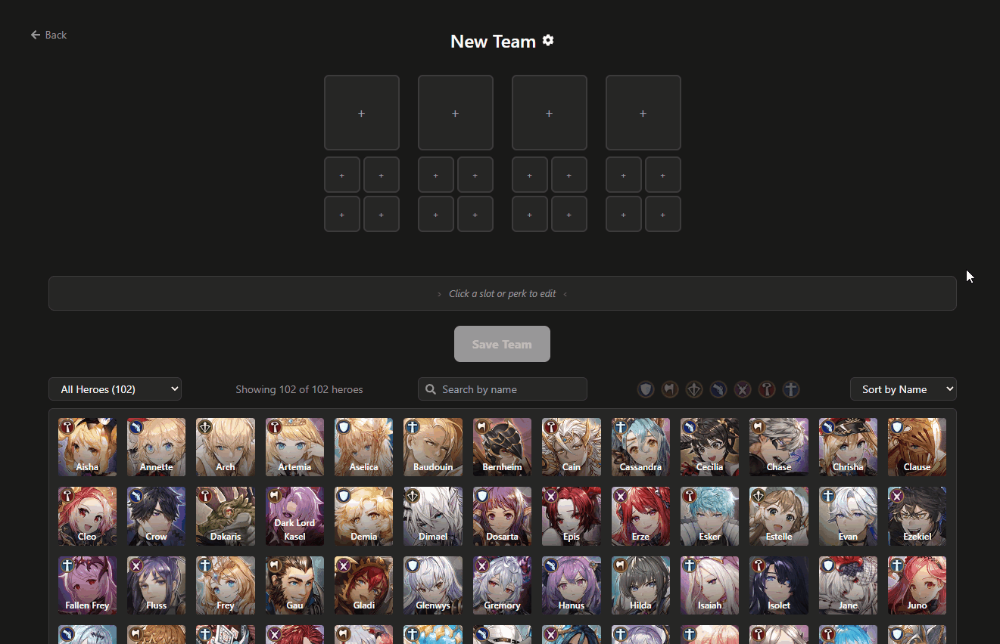

# King's Raid Planner

> A full-stack team builder and community sharing platform for the game **King's Raid**.
> Build hero compositions, configure loadouts, and browse teams from other players.

**Live app:** [kingsraid-planner.vercel.app](https://kingsraid-planner.vercel.app)

---



---

## Features

**Team Builder**

- Create teams of 4 to 8 heroes
- Configure each hero's Unique Weapon, Unique Treasure, Artifact, Gear Set, Perks (T1/T2/T3/T5), and Soul Weapon advancement
- Save, edit, and delete teams with public/private visibility

**Team Browser**

- Browse and search public teams from the community
- Filter by game content: World Bosses, Raids, Guild Conquest, Guild Raids, Trials
- Upvote and bookmark favorite teams

**Authentication**

- Email/password registration with email verification
- Google OAuth login
- JWT access + refresh token flow stored in HTTP-only cookies
- Password reset via email

**Account**

- Avatar and banner customization
- Preferences for default team visibility and color theme
- Username, email, and password management

---

## Tech Stack

| Layer    | Technology                                      |
| -------- | ----------------------------------------------- |
| Frontend | React 19, React Router 7, Tailwind CSS          |
| Backend  | Node.js, Express 4                              |
| Database | MongoDB (Mongoose 8)                            |
| Auth     | JWT (access + refresh tokens), Google OAuth 2.0 |
| Email    | Resend API                                      |
| Testing  | Jest, Supertest (22 backend tests)              |
| CI       | GitHub Actions                                  |
| Hosting  | Vercel (frontend), Railway (backend)            |

---

## Architecture

```
frontend/ (React 19 + Tailwind)   →  Vercel       port 3000
backend/  (Node.js + Express 4)   →  Railway      port 3002
database  (MongoDB Atlas)
```

The frontend communicates with the backend via a REST API (`/api/v2/`) using cookie-based authentication. State is managed through 9 React Contexts covering auth, team data, heroes, artifacts, gear sets, perks, modals, overlays, and slot panels.

---

## Project Structure

```
kingsraid-planner/
├── frontend/
│   └── src/
│       ├── components/
│       │   ├── TeamBuilder/       # Create/edit team UI, save button
│       │   ├── TeamSlots/         # Team grid, hero slots, sub-slots, item overlays, perk preview
│       │   ├── SlotPanel/         # Inline item selector panels (UW, UT, Artifact, Gear Set, Perks)
│       │   ├── HeroGrid/          # Hero selection grid with class/role filters
│       │   ├── Modals/            # Modal manager, team settings, confirmation dialogs
│       │   ├── Profile/           # Public profile page components
│       │   └── UI/                # Navbar, footer, layout
│       ├── contexts/              # 9 React Contexts (auth, team, heroes, artifacts, gear sets, perks, modals, overlays, slot panel)
│       ├── hooks/                 # useApi, useHeroData, useOverlayTrigger
│       ├── services/              # Base fetch wrapper, artifact service, image cache
│       ├── utils/                 # Team converter (DB ↔ frontend), perk converter, sort helpers
│       ├── constants/             # Game content tags and boss groups
│       └── Routes/                # Page-level components
│
└── backend/
    └── src/
        ├── models/                # Mongoose schemas (User, Team, Hero, Artifact, GearSet, Perk)
        ├── routes/                # Express route handlers
        ├── middlewares/           # JWT auth middleware (requireAuth, optionalAuth)
        ├── services/              # Hero, artifact, gear set, perk business logic
        └── utils/                 # JWT helpers, mailer, team data converter
    └── tests/                     # Jest + Supertest integration tests (22 tests)
    └── scripts/                   # Game data import scripts (heroes, artifacts, gear sets, perks)
```

---

## API Overview

All routes are prefixed `/api/v2/`.

| Resource              | Methods            | Notes                                                   |
| --------------------- | ------------------ | ------------------------------------------------------- |
| `/auth/*`             | POST               | Register, login, logout, refresh, OAuth, reset password |
| `/auth/me`            | GET                | Current authenticated user                              |
| `/heroes`             | GET                | All heroes; `/:slug` for single                         |
| `/artifacts`          | GET                | All artifacts; `/:slug` for single                      |
| `/gearsets`           | GET                | All gear sets; `/:slug` for single                      |
| `/perks`              | GET                | By tier, hero, or class                                 |
| `/teams`              | GET, POST          | List (filterable) / Create                              |
| `/teams/:id`          | GET, PATCH, DELETE | Lookup by slug or ObjectId                              |
| `/teams/:id/upvote`   | POST               | Auth required                                           |
| `/teams/:id/bookmark` | POST               | Auth required                                           |
| `/users/:id`          | GET, PUT           | Public profile / Update account                         |

---

## Development

<details>
<summary>Run locally</summary>

**Prerequisites:** Node.js 18+, MongoDB instance, Resend API key (optional), Google OAuth credentials (optional)

```bash
git clone https://github.com/Torenciel/kingsraid-planner.git
cd kingsraid-planner
npm run install:all
```

Create `backend/.env` (see `backend/.env.example` for all variables), then:

```bash
npm run dev          # starts frontend (3000) + backend (3002)

cd backend
npm run import-all   # populate DB with game data (first run only)
npm test             # run backend test suite
```

</details>

---

## License

Fan-made project. King's Raid is owned by MasangGames. All game assets belong to their respective owners. Not affiliated with or endorsed by MasangGames.
